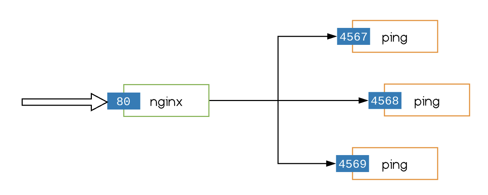

# nginx Load Balancer

This piece of code illustrates how to provision nginx on a Centos 7 host to load balance requests among 3 intances of a backend service running on that same host using [ansible](https://docs.ansible.com/ansible/latest/index.html).

## Design



## Assumptions

1. [Ansible](https://docs.ansible.com/ansible/latest/installation_guide/intro_installation.html#installing-ansible-on-macos) is already installed.
1. The IP of the host is `111.111.111.111`.
1. The private key to be used host connection is `private.pem` and it is located at `~/Documents`.
1. The backend services will be running on ports `4567`, `4568` and `4569`.

## Usage

Execute the following in your terminal to run the demo:

```sh
make run
```

That should do the following:

1. Download and [sets up nginx](https://upcloud.com/community/tutorials/configure-load-balancing-nginx/).
1. [Install golang](https://www.vultr.com/docs/how-to-install-golang-1-8-3-on-centos-7-ubuntu-16-04-lts-and-debian-9-stretch?gclid=Cj0KCQjwjoH0BRD6ARIsAEWO9DtXuH2k0W1iu4vsiJwE8Ww7QFU8WKbw1M_NXazcudSHzLTvLOm0ROAaAoncEALw_wcB) on host.
1. Clone [app respository](https://github.com/ekowcharles/ping/tree/nginx) and set up backend services.

## Confirm it Works

1. Visit http://111.111.111.111/.
1. Refresh the page a couple of times.
1. The text in your browser should alternate among the following (nginx uses Round Robin loadbalancing algorithm by default):

   ```
   Listening on port 4567 ...
   Listening on port 4568 ...
   Listening on port 4569 ...
   ```
