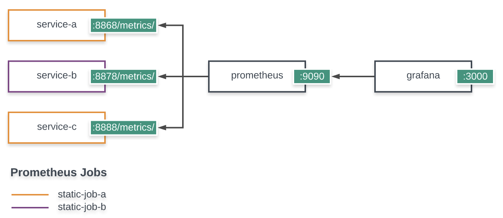

# Prometheus - Grafana

Demo showing how to scrape service metrics and have them show up in Grafana.

## Design



## Stack

1. [Docker](https://docker-curriculum.com/)
1. [go](https://golang.org/doc/tutorial/getting-started)
1. [Frafana](https://grafana.com/docs/grafana/latest/getting-started/getting-started/)
1. [Prometheus](https://prometheus.io/docs/prometheus/latest/getting_started/)

## Usage

Execute the following:

```
$ make all
```

That should do the following:

1. Build a docker image for `tick` - a service that simply spits out random metrics in the PQL format.
1. Build a `prometheus` image using custom configuration for jobs and targets.
1. Build `grafana` image ready with prometheus data source and a panel showing metrics collected from the `tick` services.
1. Execute a docker compose file that wires up everything together.

To test, visit the endpoints shown in the diagram above. The grafana username is `admin` and password is the value you provided for `GF_SECURITY_ADMIN_PASSWORD` in `docker-compose.yml`.

## References

- [Grafana Docker](https://grafana.com/docs/grafana/latest/installation/docker/)
- [Grafana Provisioning](https://grafana.com/docs/grafana/latest/administration/provisioning/)
- [Promethues Configuration](https://prometheus.io/docs/prometheus/latest/configuration/configuration/)
- [Grafana-Prometheus Configuration](https://grafana.com/docs/grafana/latest/features/datasources/prometheus/)
- [Prometheus Remote Storage Systems](https://prometheus.io/docs/operating/integrations/#remote-endpoints-and-storage)
